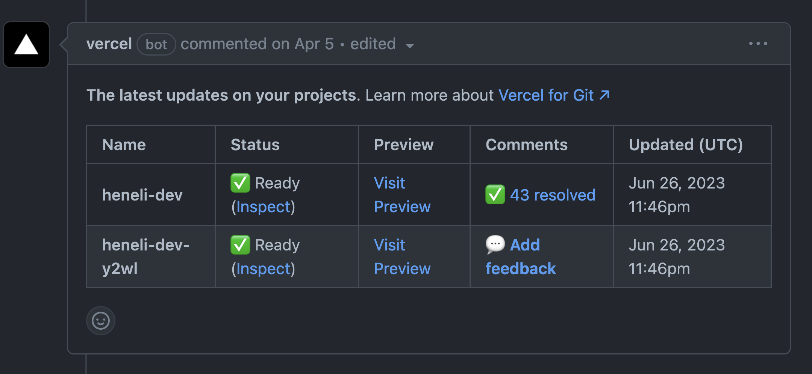

# Blog Feedback Guide

Feedback on early drafts is welcome and encouraged, but please hold off on sharing articles before they're published.

- [Blog Feedback Guide](#blog-feedback-guide)
  - [Draft](#draft)
  - [Live Previews](#live-previews)
  - [Guidelines](#guidelines)

## Draft

Drafts are available for feedback can be found under Pull requests labeled `feedback welcome`.

https://github.com/hkailahi/heneli.dev/labels/feedback%20welcome

## Live Previews

Live previews for each PR branch are available and updated on every branch commit. Preview links can be found with the first comment on each PR.

  

## Guidelines

Feedback comments can be left on the Github PR or directly on the draft page using Vercel's comment annotations. As Vercel's comments floating (not attached to text) they will appear in different places.

If you would like to trade public on your blog/tool/etc, add a post detailing what you're looking for in the [Show-and-Tell discussions](https://github.com/hkailahi/heneli.dev/discussions/categories/show-and-tell) page. I promise to give genuine feedback if I have thoughts worth sharing. If you would like private feedback, ping me on twitter or send an email.

Please don't share draft articles online before they are published.
